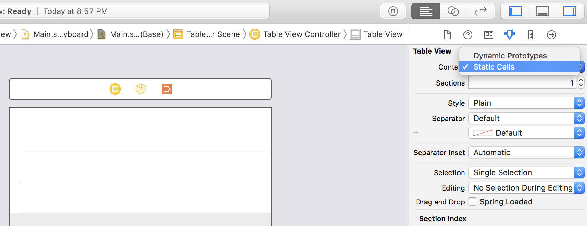
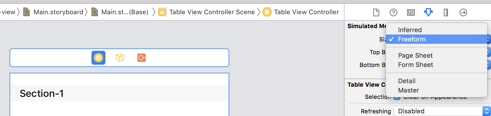
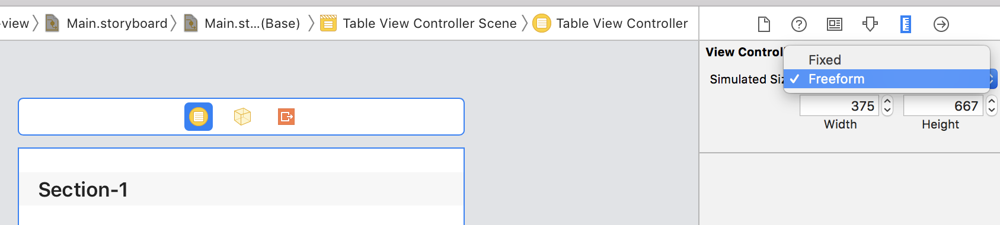
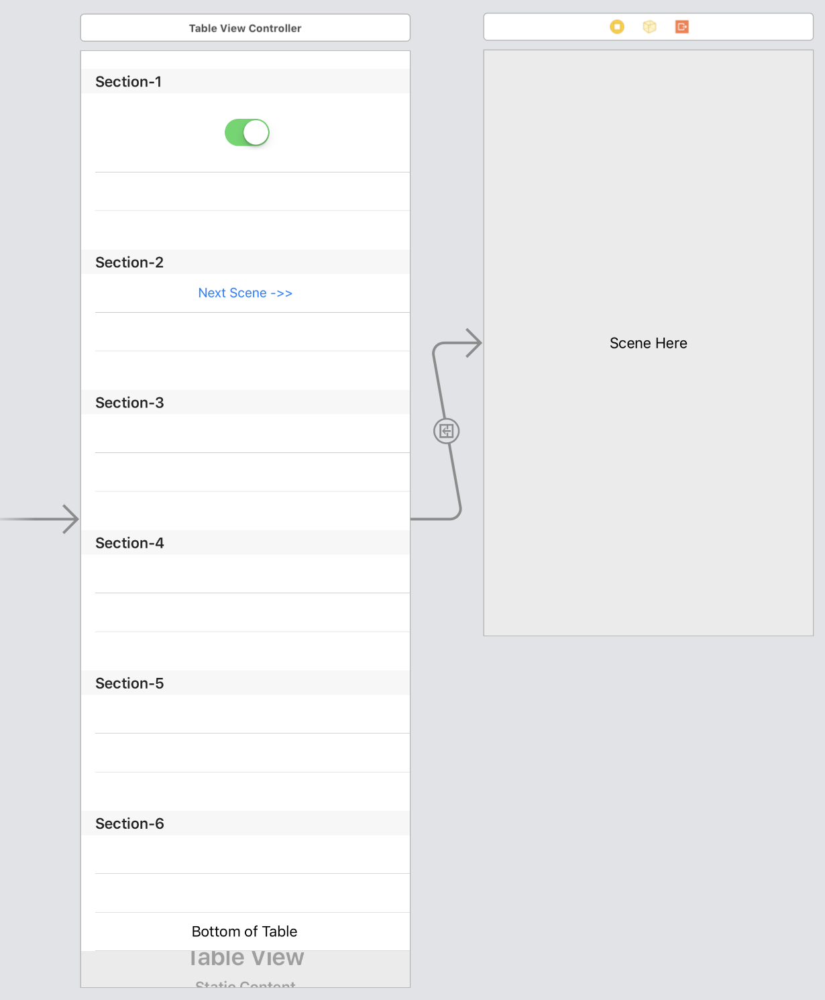

# Static table view in iOS

A static table view provides a quick layout for developing a settings view in an iOS app. The first step is to select "Static Cells" for the content in the table view controller.

{: .img-fluid}

Next, select the "Freeform" properties in the "Attribures" and "Size Inspector" panels. This allows the height of table view scene in the storyboard to be adjusted beyond the device size. After adjusting the height of the table view scene, you can run the Xcode project and vertically scroll the table view.

{: .img-fluid}

{: .img-fluid}

Sections can be added to the table view to group related rows and row height can also be adjusted to accommodate content. A comparison of a tall static table view controller next to a regular view controller is shown in the image below. The example Xcode project for this article is available on [GitHub](https://github.com/wigging/swift-ios).

{: .img-fluid}