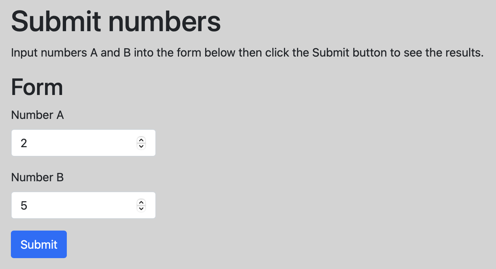
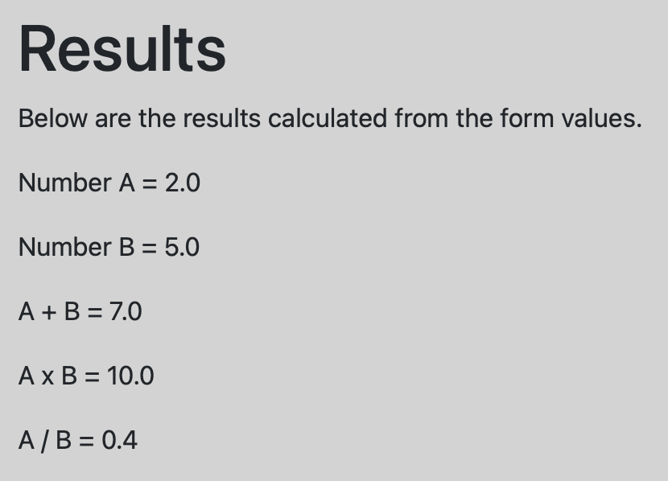
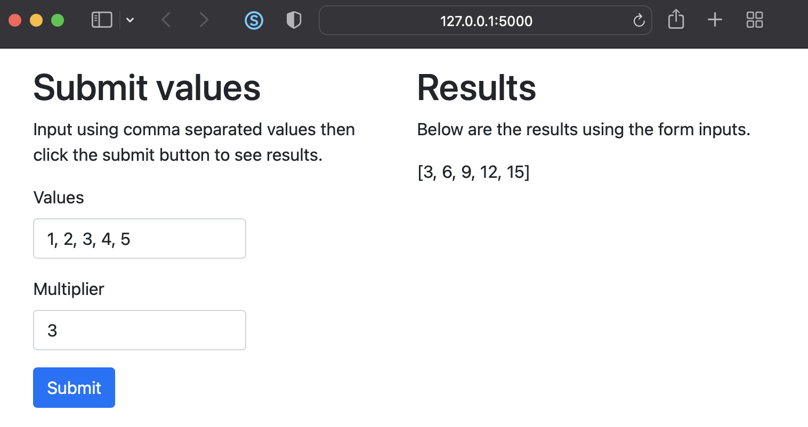

An HTML form collects user input on a web page. Using Flask, the input can be evaluated in Python and used elsewhere in the web application. The examples in the following sections demonstrate a basic form with Flask and using Htmx for interactivity.

## Form input example

As an example, in the `app.py` file shown below, the index or home page renders the HTML form. The input from the form is handled as two numbers. The sum, product, and fraction of the numbers are calculated then passed to the results page.

```python
# app.py

from flask import Flask
from flask import render_template
from flask import request

app = Flask(__name__)


@app.route('/')
def index():
    return render_template('index.html')


@app.route('/results', methods=['POST'])
def results():
    a = float(request.form['numberA'])
    b = float(request.form['numberB'])

    sum_ab = a + b
    mult_ab = a * b
    div_ab = a / b

    res = {
        'a': a, 'b': b,
        'sum_ab': sum_ab, 'mult_ab': mult_ab, 'div_ab': div_ab
    }

    return render_template('results.html', results=res)
```

<p></p>

<p></p>

The HTML templates used by the app are shown below. Notice that [Bootstrap](https://getbootstrap.com) is used for the style and layout of the pages.

```html
<!-- index.html -->

<!DOCTYPE html>
<html lang="en">
<head>
    <meta charset="utf-8">
    <meta name="viewport" content="width=device-width, initial-scale=1">
    <link href="https://cdn.jsdelivr.net/npm/bootstrap@5.0.0-beta3/dist/css/bootstrap.min.css" rel="stylesheet">

    <title>Home Page</title>

    <style type="text/css">
        body { background-color: lightgray; }
        input { max-width: 200px; }
    </style>
</head>
<body>
    <div class="container">
        <div class="row">
            <div class="col">

                <h1 class="mt-3">Submit numbers</h1>

                <p>Input numbers A and B into the form below then click the Submit button to see the results.</p>

                <h2>Form</h2>
                <form action="/results" method="POST">
                    <div class="mb-3">
                        <label for="numberA" class="form-label">Number A</label>
                        <input type="number" step="any" class="form-control" name="numberA">
                    </div>
                    <div class="mb-3">
                        <label for="numberB" class="form-label">Number B</label>
                        <input type="number" step="any" class="form-control" name="numberB">
                    </div>
                    <button type="submit" class="btn btn-primary">Submit</button>
                </form>

            </div>
        </div>
    </div>
</body>
</html>
```

```html
<!-- results.html -->

<!DOCTYPE html>
<html lang="en">
<head>
    <meta charset="utf-8">
    <meta name="viewport" content="width=device-width, initial-scale=1">
    <link href="https://cdn.jsdelivr.net/npm/bootstrap@5.0.0-beta3/dist/css/bootstrap.min.css" rel="stylesheet">

    <title>Results Page</title>

    <style type="text/css">
        body { background-color: lightgray; }
    </style>
</head>
<body>
    <div class="container">
        <div class="row">
            <div class="col">

                <h1 class="mt-3">Results</h1>

                <p>Below are the results calculated from the form values.</p>

                <p>Number A = {{ results['a'] }}</p>
                <p>Number B = {{ results['b'] }}</p>
                <p>A + B = {{ results['sum_ab'] }}</p>
                <p>A x B = {{ results['mult_ab'] }}</p>
                <p>A / B = {{ results['div_ab'] }}</p>

            </div>
        </div>
    </div>

</body>
</html>
```

## Form input with Htmx

[Htmx](https://htmx.org) allows you to develop dynamic, interactive web pages without complex JavaScript. The example below uses Htmx in a Flask app to submit a form when the page loads. Results calculated from the form values are displayed on the same page.

<p></p>

```python
# app.py

from flask import Flask
from flask import render_template
from flask import request

app = Flask(__name__)

@app.route('/')
def index():
    return render_template('index.html')

@app.route('/results', methods=['POST'])
def results():
    values = request.form['values']
    multiplier = request.form['multiplier']

    vals = list(map(int, values.split(', ')))
    mult = int(multiplier)

    y = []
    for val in vals:
        y.append(val * mult)

    return render_template('results.html', results=y)
```

The main webpage `index.html` is shown below. Notice the use of Htmx to handle the form submission when the page loads and when the user clicks the submit button.

```html
<!-- templates/index.html -->

<!DOCTYPE html>
<html lang="en">
<head>
    <meta charset="utf-8">
    <meta name="viewport" content="width=device-width, initial-scale=1">
    <link href="https://cdn.jsdelivr.net/npm/bootstrap@5.1.3/dist/css/bootstrap.min.css" rel="stylesheet" integrity="sha384-1BmE4kWBq78iYhFldvKuhfTAU6auU8tT94WrHftjDbrCEXSU1oBoqyl2QvZ6jIW3" crossorigin="anonymous">

    <title>Home Page</title>
</head>
<body>
    <div class="container">
        <div class="row">

            <div class="col">
                <h1 class="mt-3">Submit values</h1>

                <p>Input using comma separated values then click the submit button to see results.</p>

                <form hx-post="/results" hx-target="#results" hx-trigger="load, submit">
                    <div class="mb-3">
                        <label for="values" class="form-label">Values</label>
                        <input type="text" class="form-control" style="max-width:200px;" name="values" value="1, 2, 3, 4, 5">
                    </div>
                    <div class="mb-3">
                        <label for="multiplier" class="form-label">Multiplier</label>
                        <input type="text" class="form-control" style="max-width:200px;" name="multiplier" value="3">
                    </div>
                    <button type="submit" class="btn btn-primary">Submit</button>
                </form>
            </div>

            <div class="col">
                <div id="results"></div>
            </div>

        </div>
    </div>

    <script src="https://unpkg.com/htmx.org@1.6.1" integrity="sha384-tvG/2mnCFmGQzYC1Oh3qxQ7CkQ9kMzYjWZSNtrRZygHPDDqottzEJsqS4oUVodhW" crossorigin="anonymous"></script>

</body>
</html>
```

```html
<!-- templates/results.html -->

<h1 class="mt-3">Results</h1>

<p>Below are the results using the form inputs.</p>

{{ results }}
```

