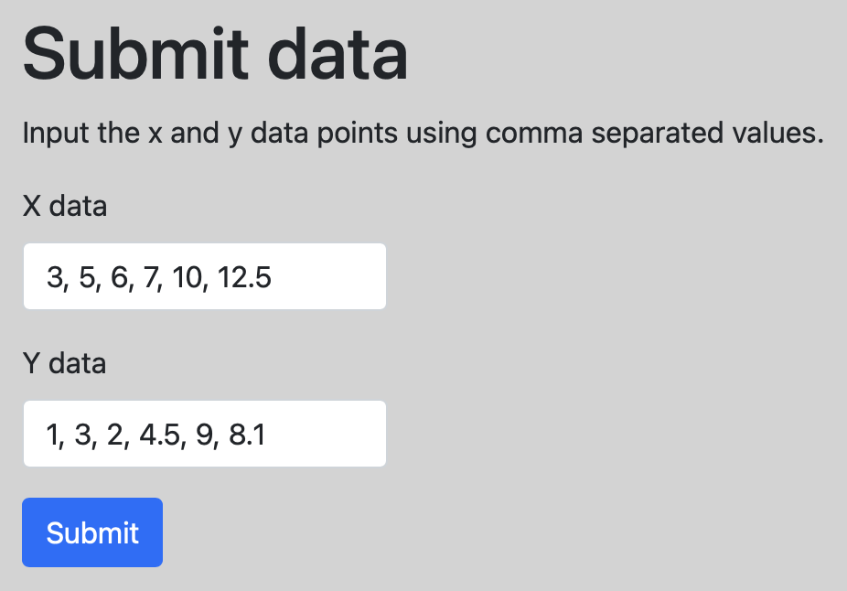
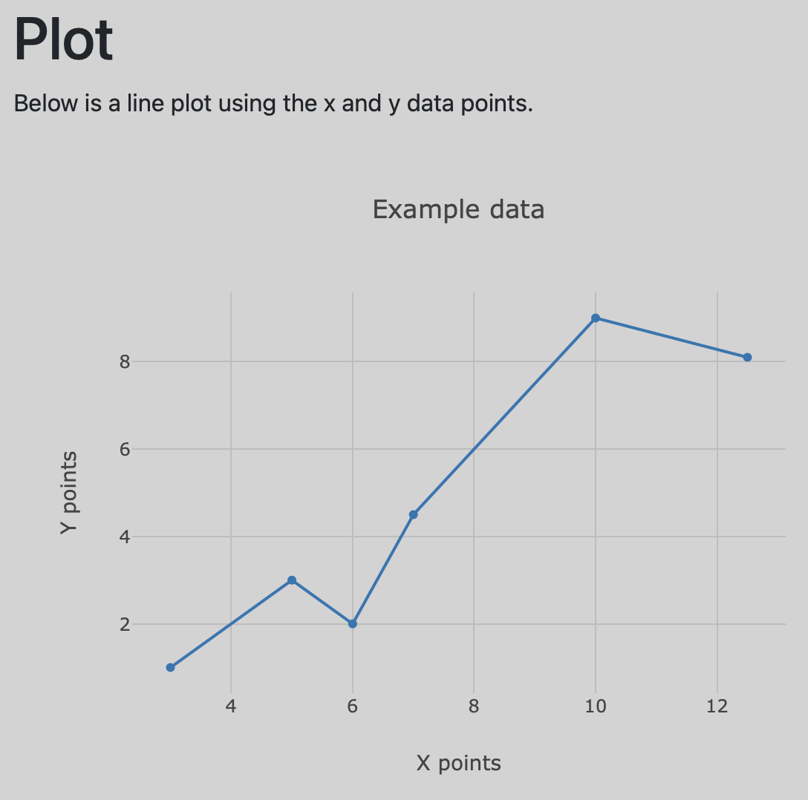
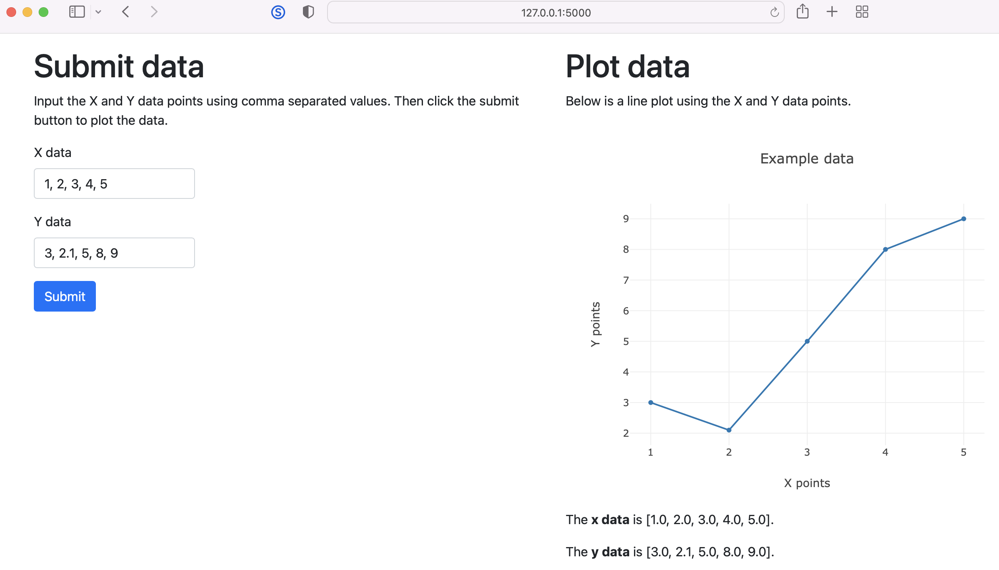

[Plotly](https://plotly.com) is a great graphing library for scientific applications. [Htmx](https://htmx.org) allows you to develop dynamic, interactive web pages without complex JavaScript. The following sections demonstrate a Plotly graph and Htmx with Flask.

## Plotly graph

The example below demonstrates using the Plotly JavaScript library in a Flask app.

```python
# app.py

from flask import Flask
from flask import render_template
from flask import request

app = Flask(__name__)


@app.route('/')
def index():
    return render_template('index.html')


@app.route('/plot', methods=['POST'])
def plot():
    xdata = request.form['xdata']
    ydata = request.form['ydata']

    x = list(map(float, xdata.split(', ')))
    y = list(map(float, ydata.split(', ')))
    data = {'x': x, 'y': y}

    return render_template('plot.html', data=data)
```

<p></p>

<p></p>

The HTML templates used to render the index and plot pages are shown below.

```html
<!-- index.html -->

<!DOCTYPE html>
<html lang="en">
<head>
    <meta charset="utf-8">
    <meta name="viewport" content="width=device-width, initial-scale=1">
    <link href="https://cdn.jsdelivr.net/npm/bootstrap@5.0.0-beta3/dist/css/bootstrap.min.css" rel="stylesheet" integrity="sha384-eOJMYsd53ii+scO/bJGFsiCZc+5NDVN2yr8+0RDqr0Ql0h+rP48ckxlpbzKgwra6" crossorigin="anonymous">

    <title>Home Page</title>

    <style type="text/css">
        body { background-color: lightgray; }
        input { max-width: 200px; }
    </style>
</head>
<body>
    <div class="container">
        <div class="row">
            <div class="col">

                <h1 class="mt-3">Submit data</h1>

                <p>Input the x and y data points using comma separated values.</p>

                <form action="/plot" method="POST">
                    <div class="mb-3">
                        <label for="xdata" class="form-label">X data</label>
                        <input type="text" class="form-control" name="xdata">
                    </div>
                    <div class="mb-3">
                        <label for="ydata" class="form-label">Y data</label>
                        <input type="text" class="form-control" name="ydata">
                    </div>
                    <button type="submit" class="btn btn-primary">Submit</button>
                </form>

            </div>
        </div>
    </div>
</body>
</html>
```

```html
<!-- plot.html -->

<!DOCTYPE html>
<html lang="en">
<head>
    <meta charset="utf-8">
    <meta name="viewport" content="width=device-width, initial-scale=1">
    <link href="https://cdn.jsdelivr.net/npm/bootstrap@5.0.0-beta3/dist/css/bootstrap.min.css" rel="stylesheet" integrity="sha384-eOJMYsd53ii+scO/bJGFsiCZc+5NDVN2yr8+0RDqr0Ql0h+rP48ckxlpbzKgwra6" crossorigin="anonymous">
    <script src="https://cdn.plot.ly/plotly-latest.min.js"></script>

    <title>Plot Page</title>

    <style type="text/css">
        body { background-color: lightgray; }
    </style>
</head>
<body>
    <div class="container">
        <div class="row">
            <div class="col">

                <h1 class="mt-3">Plot</h1>

                <p>Below is a line plot using the x and y data points.</p>

                <div id="graph" style="width:600px;height:480;"></div>

                <script>
                    var graphDiv = document.getElementById('graph');

                    var data = [{
                        x: {{ data['x'] }},
                        y: {{ data['y'] }},
                        type: 'line'
                    }];

                    var layout = {
                        title: 'Example data',
                        xaxis: {
                            title: 'X points',
                            gridcolor: 'rgb(189, 189, 189)',
                        },
                        yaxis: {
                            title: 'Y points',
                            gridcolor: 'rgb(189, 189, 189)',
                            zeroline: false
                        },
                        paper_bgcolor: 'rgba(0,0,0,0)',
                        plot_bgcolor: 'rgba(0,0,0,0)'
                    };

                    Plotly.newPlot(graphDiv, data, layout)
                </script>

            </div>
        </div>
    </div>
</body>
</html>
```

## Plotly graph with Htmx

The example below uses Htmx in a Flask app to display a Plotly graph in a web page without updating the entire page.

<p></p>

```py
# app.py

from flask import Flask
from flask import render_template
from flask import request

app = Flask(__name__)


@app.route('/')
def index():
    return render_template('index.html')


@app.route('/plot', methods=['POST'])
def plot():
    xdata = request.form['xdata']
    ydata = request.form['ydata']

    x = list(map(float, xdata.split(', ')))
    y = list(map(float, ydata.split(', ')))

    data = {'x': x, 'y': y}
    return render_template('plot.html', data=data)
```

The html templates used for the Flask app are given below. The Plotly graph is created using the `plot.html` template.

```html
<!-- templates/index.html -->

<!DOCTYPE html>
<html lang="en">
<head>
    <meta charset="utf-8">
    <meta name="viewport" content="width=device-width, initial-scale=1">
    <link href="https://cdn.jsdelivr.net/npm/bootstrap@5.1.3/dist/css/bootstrap.min.css" rel="stylesheet" integrity="sha384-1BmE4kWBq78iYhFldvKuhfTAU6auU8tT94WrHftjDbrCEXSU1oBoqyl2QvZ6jIW3" crossorigin="anonymous">

    <title>Home Page</title>
</head>
<body>
    <div class="container">
        <div class="row">

            <div class="col">
                <h1 class="mt-3">Submit data</h1>

                <p>Input the X and Y data points using comma separated values. Then click the submit button to plot the data.</p>

                <form hx-post="/plot" hx-target="#graph">
                    <div class="mb-3">
                        <label for="xdata" class="form-label">X data</label>
                        <input type="text" class="form-control" style="max-width:200px;" name="xdata" value="1, 2, 3, 4, 5">
                    </div>
                    <div class="mb-3">
                        <label for="ydata" class="form-label">Y data</label>
                        <input type="text" class="form-control" style="max-width:200px;" name="ydata" value="3, 2.1, 5, 8, 9">
                    </div>
                    <button type="submit" class="btn btn-primary">Submit</button>
                </form>
            </div>

            <div class="col">
                <h1 class="mt-3">Plot data</h1>

                <p>Below is a line plot using the X and Y data points.</p>

                <div id="graph" style="width:600px;height:480px;"></div>
            </div>

        </div>
    </div>

    <script src="https://unpkg.com/htmx.org@1.6.1" integrity="sha384-tvG/2mnCFmGQzYC1Oh3qxQ7CkQ9kMzYjWZSNtrRZygHPDDqottzEJsqS4oUVodhW" crossorigin="anonymous"></script>
    <script src="https://cdn.plot.ly/plotly-2.8.3.min.js"></script>

</body>
</html>
```

```html
<!-- templates/plot.html -->

<script>
    var graphDiv = document.getElementById('graph');

    var data = [{
        x: {{ data['x'] }},
        y: {{ data['y'] }},
        type: 'line'
    }];

    var layout = {
        title: 'Example data',
        xaxis: {
            title: 'X points'
        },
        yaxis: {
            title: 'Y points'
        }
    };

    Plotly.newPlot(graphDiv, data, layout)
</script>

<p>The <strong>x data</strong> is {{ data['x'] }}.</p>

<p>The <strong>y data</strong> is {{ data['y'] }}.</p>
```

